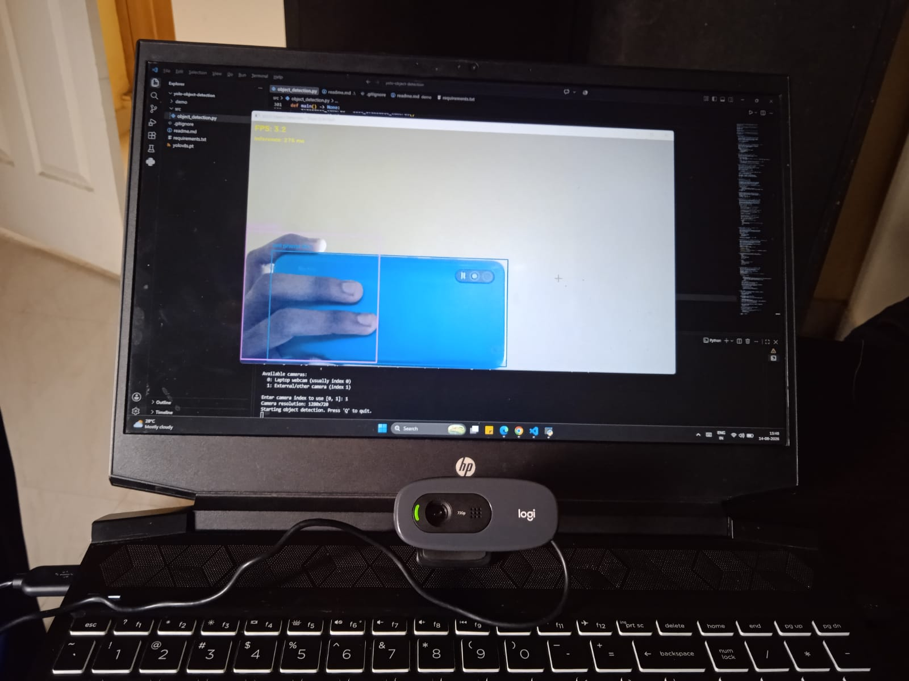

# YOLO Real-Time Object Detection Using OpenCV

## Overview

This project performs real-time object detection using a webcam feed. It combines **OpenCV** for video capture and display with a pretrained **Ultralytics YOLOv8** model for detection. Every detected object is drawn with a bounding box, its class name, and its confidence score, while the app also reports live FPS and per-frame inference time.

<!-- Add a screenshot here once available, e.g.: -->
<!--  -->

## Features

- Real-time webcam object detection
- Bounding boxes drawn around every detected object
- Object class name displayed per detection
- Confidence score displayed as a percentage
- Live FPS monitoring (smoothed) and per-frame inference time (ms)
- Automatic detection of available cameras, with a selection prompt when more than one is found
- Configurable confidence threshold
- Configurable IoU threshold
- Configurable capture resolution
- `Q` / `q` to exit
- Graceful error handling for missing cameras, failed camera opens, dropped frames, and model load failures

## Architecture

```
Webcam
  ↓
OpenCV Frame Capture
  ↓
YOLO Inference
  ↓
Detection Results (boxes, class IDs, confidence scores)
  ↓
Bounding Box + Class Name + Confidence (drawn with OpenCV)
  ↓
OpenCV Display
```

## Project Structure

```
yolo-object-detection/
│
├── demo/
│   ├── demo.mp4                 # optional short demo recording
│   └── detection_preview.png    # optional screenshot
│
├── src/
│   └── object_detection.py      # main application
│
├── .gitignore
├── requirements.txt
└── README.md
```

`yolov8s.pt` (the model weights file) is **not** committed to this repo — Ultralytics downloads it automatically the first time the script runs.

## Requirements

- Python 3.9–3.12 (recommended; very new Python releases can lag behind PyTorch/Ultralytics compatibility)
- [OpenCV](https://pypi.org/project/opencv-python/) — webcam capture, frame display, drawing
- [Ultralytics YOLO](https://docs.ultralytics.com/) — pretrained object detection model

## Installation

```bash
# 1. Create a virtual environment
python -m venv venv

# 2. Activate it (Windows)
venv\Scripts\activate

# 2. Activate it (macOS/Linux)
source venv/bin/activate

# 3. Install dependencies
pip install -r requirements.txt
```

## Running

```bash
python src/object_detection.py
```

On first run:
- Ultralytics downloads the YOLOv8 model weights automatically (a few MB, requires internet once).
- The terminal lists all detected cameras. If more than one is found, you'll be prompted to choose; if only one is found, it's used automatically.
- A window opens showing the live annotated video feed with bounding boxes, labels, FPS, and inference time.

## Controls

| Key | Action |
|---|---|
| `Q` / `q` | Exit the application |

## Configuration

All key parameters are defined as constants near the top of `src/object_detection.py`:

| Variable | Purpose | Default |
|---|---|---|
| `MODEL_NAME` | Which YOLOv8 weights file to load | `"yolov8s.pt"` |
| `CONFIDENCE_THRESHOLD` | Minimum confidence required to display a detection | `0.4` |
| `IOU_THRESHOLD` | Overlap threshold used by Non-Max Suppression to remove duplicate boxes | `0.45` |
| `FRAME_WIDTH` / `FRAME_HEIGHT` | Requested webcam capture resolution | `1280` / `720` |

These are kept as simple constants rather than a separate config file — the project is small enough that a dedicated config layer would add indirection without meaningful benefit.

## Performance

Actual FPS and inference time depend on several factors:

- CPU/GPU used for inference
- YOLO model size (`n` vs `s` vs `m`, etc.)
- Input/capture resolution
- Number of objects detected in a given frame

The app displays both a smoothed FPS value and per-frame inference time (ms) live on screen, so real performance on your machine is always visible directly in the app — no numbers below are estimated.

### Benchmark (fill in with your own measurements)

| Model | Resolution | FPS | Inference (ms) |
|---|---|---|---|
| YOLOv8n | 640x480 | TBD | TBD |
| YOLOv8s | 640x480 | TBD | TBD |
| YOLOv8n | 1280x720 | TBD | TBD |
| YOLOv8s | 1280x720 | TBD | TBD |

To fill this in: change `MODEL_NAME` and `FRAME_WIDTH`/`FRAME_HEIGHT` in `src/object_detection.py`, run the app, and record the on-screen FPS/inference values after they stabilize for a few seconds.

## Limitations

- Performance depends heavily on hardware — CPU-only inference is significantly slower than GPU inference.
- The pretrained model only detects the 80 object classes it was trained on (the COCO dataset — e.g. person, car, chair, laptop, phone, bottle). It cannot recognize custom or brand-specific objects.
- Detection quality depends on webcam quality, lighting, and object distance/angle.
- CPU inference may not sustain real-time FPS with larger models (e.g. `yolov8m` or bigger) on modest laptops.

## Future Improvements

- GPU acceleration (CUDA) for higher FPS
- Side-by-side comparison across YOLO model sizes
- Object tracking across frames
- Training on a custom dataset for domain-specific classes
- Support for video-file input in addition to a live webcam
- Structured performance benchmarking across hardware
- Deployment on edge devices (e.g. Raspberry Pi, Jetson Nano)

## How Detection Works (for interview reference)

1. Each webcam frame is passed to `model()`, which returns a `Results` object per input frame.
2. `result.boxes` holds every detection found in that frame.
3. For each detected box:
   - `box.xyxy[0]` → bounding box coordinates `[x1, y1, x2, y2]` (top-left and bottom-right corners, in pixels)
   - `box.conf[0]` → confidence score in `[0, 1]`, shown on screen as a percentage
   - `box.cls[0]` → numeric class ID, mapped to a readable label via `model.names`
4. Detections below `CONFIDENCE_THRESHOLD` are filtered out by passing `conf=CONFIDENCE_THRESHOLD` directly into the `model()` call, so only meaningful detections reach the drawing step.
5. `IOU_THRESHOLD` controls Non-Max Suppression — when the same object produces multiple overlapping boxes, IoU (the ratio of overlap area to union area between two boxes) is used to discard the redundant ones and keep the best one.
6. OpenCV draws each bounding box and label directly onto the frame, which is then shown with `cv2.imshow`.

## Troubleshooting

| Issue | Fix |
|---|---|
| `ModuleNotFoundError` for `cv2` or `ultralytics` | Re-run `pip install -r requirements.txt` inside the activated virtual environment |
| No camera found | Check physical connections; on Windows, check Settings → Privacy → Camera |
| Webcam not detected / wrong camera opens | Close other apps using the camera (Zoom, Teams, OBS); rerun and check the printed camera list |
| Low FPS / laggy video | Switch `MODEL_NAME` to `"yolov8n.pt"` for faster (but slightly less accurate) inference, or lower `FRAME_WIDTH`/`FRAME_HEIGHT` |
| First run fails to start | Requires internet access once, to auto-download the model weights file |
| Detections seem inaccurate | Ensure good lighting and that the object is one of the 80 COCO classes the model was trained on |
| Camera disconnects mid-run | The app tolerates a few dropped frames and exits cleanly with a message if the camera stops responding entirely |

## Notes

- This project intentionally focuses on detection only — no object tracking, custom training, GUI framework, or database, per project scope.
- Model weights are excluded from version control via `.gitignore` since they are large and downloaded automatically on demand.